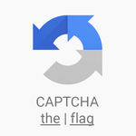
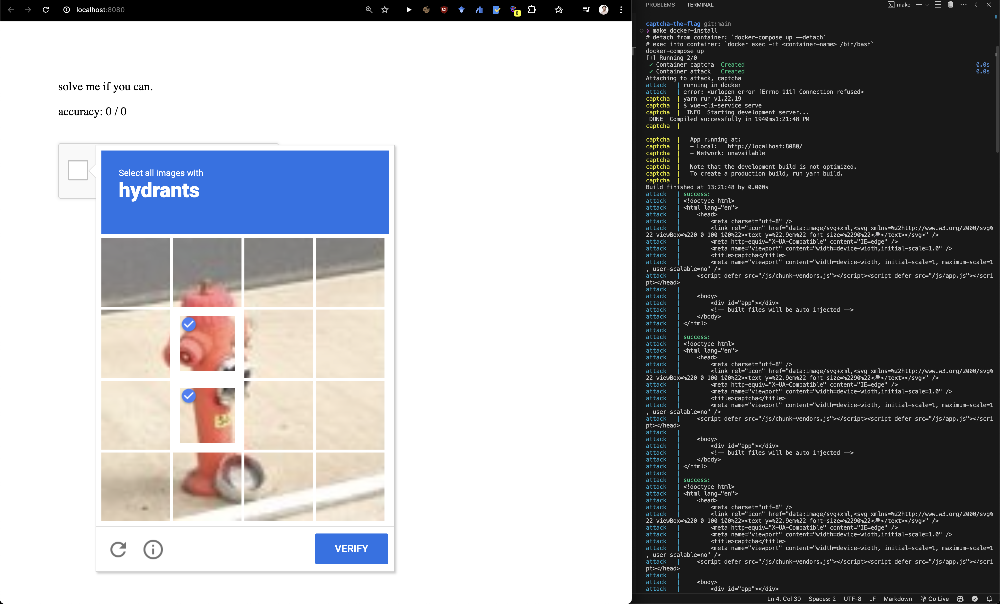

  
  <h3>CAPTCHA the Flag</h3>
  

    The reCAPTCHAv2 solving challenge.
  

 

 

Solving Google's reCAPTCHAv2 is a challenging computer vision task that tests models against humans on an even playing field. While previous solutions have achieved high success rates [^2] [^8] [^18] [^9], including 100% in a recent study by Plesner et. al [^16], these results are difficult to reproduce due to (1) the closed-source nature of reCAPTCHAv2, (2) the lack of a publicly available dataset and (3) the lack of containerized environments for easy evaluation.

This project addresses this issue by providing a reCAPTCHAv2 clone [^diff] for research and evaluation purposes. Our clone is built on the same principles as the original but with modifications to make it more accessible.

To get started, fork this repository, update the `./attack/main.py` file with your solver and run `make docker-install` (see: `make help`). This will launch the frontend on `localhost:8080`, allowing your solver to scrape and interact with it in a separate container.

Good luck! May the best solver win.

# References

[^2]: Björklund, Arvid and Uogele, Marius. Classifying Google reCAPTCHA v2 - A study
using transfer learning models and evaluating their robustness against adversarial perturbations, 2023. Student Paper.

[^8]: I Hossen, Yazhou Tu, F Rabby, Md Nazmul Islam, Hui Cao, and Xiali Hei. Bots work
better than human beings: An online system to break google’s image-based recaptcha
v2. 2019.

[^18]: Krish Sukhani, Sahil Sawant, Sarthak Maniar, and Renuka Pawar. Automating the
bypass of image-based captcha and assessing security. In 2021 12th International Conference on Computing Communication and Networking Technologies (ICCCNT), pages
01–08. IEEE, 2021.

[^9]: Md Imran Hossen, Yazhou Tu, Md Fazle Rabby, Md Nazmul Islam, Hui Cao, and Xiali
Hei. An object detection based solver for {Google’s} image {reCAPTCHA} v2. In 23rd
international symposium on research in attacks, intrusions and defenses (RAID 2020),
pages 269–284, 2020.

[^16]: Andreas Plesner, Tobias Vontobel, and Roger Wattenhofer. Breaking recaptchav2.
In 48th IEEE International Conference on Computers, Software, and Applications
(COMPSAC 2024). IEEE, 2024.

[^diff]: The most significant differences: (1) In the object detection task there must always be at least one object to click, (2) the audio challenge is not implemented, (3) the endless-object-detection task is not implemented in which the task is to stop clicking when there are no more objects left to click in contrast to the original reCAPTCHAv2 where the task is to click all objects and click `Verify` when done.
